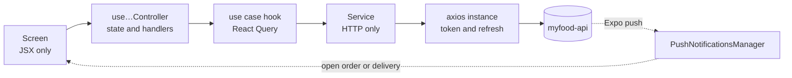

# MyFood App


Mobile app of **MyFood**, an iFood-style food delivery platform. One app, two profiles: customers
find a restaurant, order and follow the order to their door; drivers receive their deliveries and
close each one with a code only the customer has.

| Repository | What it is |
|---|---|
| [myfood-api](https://github.com/pedrohdionisio/myfood-api) | Fastify REST API, background workers and AWS Lambdas |
| [myfood-dashboard](https://github.com/pedrohdionisio/myfood-dashboard) | React dashboard for restaurant owners |
| **myfood-app** (this one) | React Native (Expo) app for customers and drivers |

## Contents

- [What it does](#what-it-does)
- [Highlights](#highlights)
- [Architecture](#architecture)
- [Running locally](#running-locally)
- [Project layout](#project-layout)
- [Stack](#stack)

## What it does

**As a customer**

- Browse the restaurants that deliver to the selected address, open now or later, filtered by
  cuisine or searched by name.
- Open a restaurant's menu and reviews, and build a cart.
- Check out choosing the address and how to pay: **Pix** in the app, or cash (with change) or card
  on delivery.
- Pay with Pix copy-and-paste, with a countdown until the code expires; the screen moves on by
  itself when the payment confirms.
- Follow the order through every status, with push notifications, and show the driver the
  **delivery code** on arrival.
- Cancel before the restaurant accepts, and review the order once it is delivered.
- Manage addresses with postal-code autocomplete (ViaCEP), the profile and password recovery.

**As a driver**

- See the deliveries assigned by the restaurant, with the address, the customer's contact and, for
  cash orders, how much to collect and how much change to bring.
- Open the address in Google Maps or call the customer from the delivery screen.
- Close the delivery by typing the customer's code, or report that it could not be delivered.
- Receive a push when an order is dispatched to them.

## Highlights

- **Two profiles, one binary.** The customer and restaurant-staff accounts live in separate user
  pools. The chosen profile decides the auth routes, the push-token route and the whole navigation
  tree: `Navigation.tsx` mounts the customer stack or the driver stack.
- **Push notifications that open the right screen.** The device's Expo token is registered for the
  signed-in profile and dropped on sign-out; tapping a notification navigates to the order or the
  delivery it is about, even from a cold start.
- **Server state only through React Query.** Screens poll while something is in motion — an open
  Pix charge, an active order, a driver's list of deliveries — and stop when it settles. Pull to
  refresh on the lists.
- **Checkout sends intent, not prices.** The cart holds products and quantities; totals are shown
  for reference, but the order is priced by the API from its own database. Every checkout carries
  an `Idempotency-Key`, so a double tap or a retry places one order.
- **Session in the secure store.** Tokens live in `expo-secure-store`, with the same single-flight
  refresh on `401` as the dashboard.
- **Quality gate on every commit.** Husky and lint-staged run Biome and the TypeScript compiler;
  code that does not pass does not get committed.

## Architecture

Three layers at the top of `src/`, each with its own import alias, and dependencies that point one
way only: `presentation` → `data` → `shared`.

| Layer | Responsibility |
|---|---|
| `data/` | Everything outside the app: API services, React Query use cases, the cart and auth contexts, secure storage, push registration |
| `presentation/` | Screens, components and layouts, each screen with a `use…Controller` hook for its logic |
| `shared/` | Navigation, entities, constants, utilities and hooks |

Each API resource is a module under `data/modules/<resource>/` with a `services/` file that only
talks HTTP and `useCases/` hooks that wrap it in React Query. `axios`, `useQuery` and `useMutation`
never appear outside `data/`, and one screen never imports another.



## Running locally

Requirements: Node.js, Yarn 1, a running [myfood-api](https://github.com/pedrohdionisio/myfood-api),
and Xcode or Android Studio: `yarn ios` and `yarn android` make a native build, which is what push
notifications need.

```bash
yarn install
cp .env.example .env
yarn ios        # or: yarn android
```

| Variable | What it is |
|---|---|
| `EXPO_PUBLIC_API_URL` | The API. On a physical device, use the machine's IP instead of `localhost`. |
| `EXPO_PUBLIC_REQUEST_DELAY_MS` | Delays every request in development, to see loading states against a local API. `0` turns it off. |

| Script | What it does |
|---|---|
| `yarn start` | Metro bundler |
| `yarn ios` · `yarn android` | Native build and run |
| `yarn typecheck` | `tsc --noEmit` |
| `yarn lint` · `yarn format` | Biome check, and check with fixes |

The API's seed (`pnpm db:seed` in myfood-api) creates customers, drivers and restaurants to sign in
with.

## Project layout

```
src/
  data/
    config/        axios instance, React Query client, ViaCEP client, environment
    contexts/      authentication and the cart
    libs/          token storage and push notification registration
    modules/       one folder per API resource: services, useCases, types
  presentation/
    screens/       one folder per screen, with its controller and components
    components/    shared UI
    layouts/
  shared/
    navigation/    auth, customer and driver stacks, notification routing
    entities/  constants/  hooks/  utils/  assets/
  styles/          Tailwind directives for NativeWind
```

The interface is in Portuguese, for the Brazilian market. Code, identifiers and documentation are in
English.

## Stack

Expo SDK 57 · React Native 0.86 · React 19 · TypeScript · NativeWind 4 (Tailwind CSS 3.4) · React
Navigation 7 · TanStack Query · axios · React Hook Form · Zod · expo-notifications ·
expo-secure-store · expo-image · Gorhom Bottom Sheet · Biome · Husky + lint-staged

## Author

**Pedro Henrique Dionisio** — [LinkedIn](https://www.linkedin.com/in/pedrohenriquedionisio/)

## License

[MIT](LICENSE)
